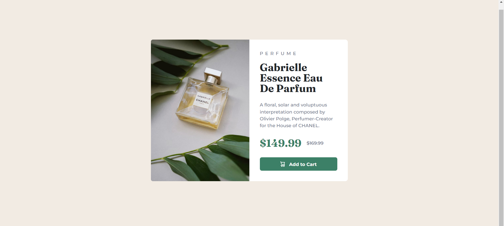
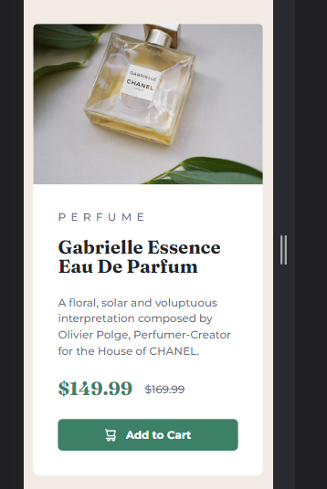

# Frontend Mentor - Product preview card component solution

This is a solution to the [Product preview card component challenge on Frontend Mentor](https://www.frontendmentor.io/challenges/product-preview-card-component-GO7UmttRfa). Frontend Mentor challenges help you improve your coding skills by building realistic projects. 

## Table of contents

- [Overview](#overview)
  - [The challenge](#the-challenge)
  - [Screenshot](#screenshot)
  - [Links](#links)
- [My process](#my-process)
  - [Built with](#built-with)
  - [What I learned](#what-i-learned)
  - [Continued development](#continued-development)
  - [Useful resources](#useful-resources)
- [Author](#author)

**Note: Delete this note and update the table of contents based on what sections you keep.**

## Overview

### The challenge

Users should be able to:

- View the optimal layout depending on their device's screen size
- See hover and focus states for interactive elements

### Screenshot

### Links

- Live Site URL: [unavailable](https://your-live-site-url.com)

## My process

### Built with

- Semantic HTML5 markup
- CSS custom properties
- Flexbox
- Mobile-first workflow
- Bootstrap 5

### What I learned

I use absolute position in image on desktop preview because the height of the image is overflow and i don't want to overflow-hidden it. So that the image fit perfectly.

### Continued development

in the future, I want to make this component in Next.Js 13

### Useful resources

- [Bootstrap](https://getbootstrap.com/) - to build flexbox grid fast

## Author

- Website - [my github repositories](https://github.com/fiqihalfito)
- LinkedIn - [@yourusername](https://www.linkedin.com/fiqih-alfito/)
